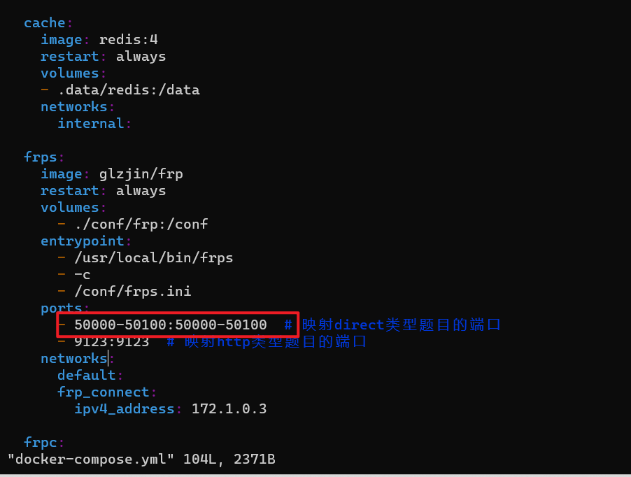

# CTFd v3.6.0 + ctfd-whale + ctfd-pages-theme 集成修改版

## 未来
- AWDplus 功能


- 麻烦给个 stars❤️

## 系统建议
- Ubuntu 23.04
- Ubuntu 22.04


## Update


> v3.6.1
- 修复前台一些bug
- 后台添加docker动态环境,增加docker images 列表
- 添加了矩阵记分板
- 新增解题播报功能
- 提交正确的flag后，可以向其他在线用户播报（并添加到通知里，也可以修改不添加）
- 此修改版本遇到任何使用上的问题，可以联系我，群号在下面。


## 注意事项
- ！！！！ 不要clone
- 请在 Releases 栏下载最新集成修改版本！！
- 


## 使用教程（只看这个安装就行了）

- 请在 Releases 栏下载最新集成修改版本


 - 初始化集群
 
```python
sudo docker swarm init --force-new-cluster
sudo docker node update --label-add='name=linux-1' $(sudo docker node ls -q)
```

​


下载zip后解压，然后cd 

```python
unzip v3.6.1.zip
cd CTFd
sudo chmod +x -R .
rm -rf ./.data # 删除 CTFd下的 .data(主要是我test期间的数据，后期上传版本前我会自己删)
sudo docker-compose up -d  # 直接启动什么都不要管
```

默认端口是80可以修改的


- 访问页面,然后先配置基础的设置


- 到后台配置一下这个

  


提交配置完成

- 切换这个主题


## 部分说明

* 集成环境

- CTFD version 3.6.0
- ctfd-whale  (docker 部署赛题)
- ctd-pages-theme (赛题分页显示)


- bilibili 视频使用教程

https://www.bilibili.com/video/BV1sK4y1w7uH

- 下载地址
https://github.com/imLZH1/ctfd_whale_pages


## Docker 安装


```python
sudo apt install docker
sudo apt install docker-compose
```


## 需要配置哪些？


* 端口范围





* docker加速

```python
/etc/docker/daemon.json 

{
  "registry-mirrors": [
    "https://docker.mirrors.ustc.edu.cn"
  ]
}
```


## 常见报错


## 交流群

```python

蔡徐坤篮球协会 信息部
QQ: 591613671
```

