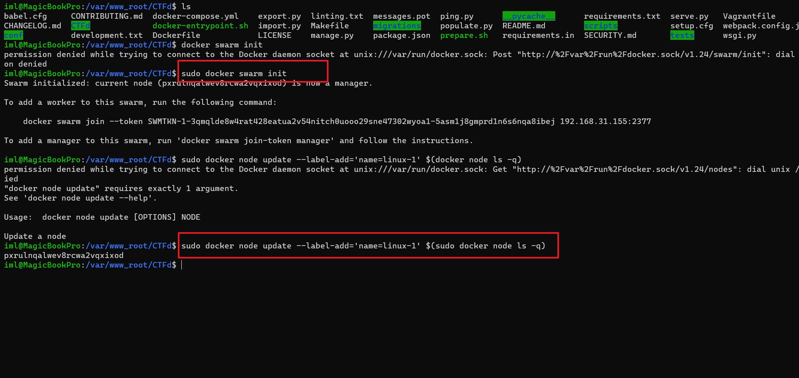
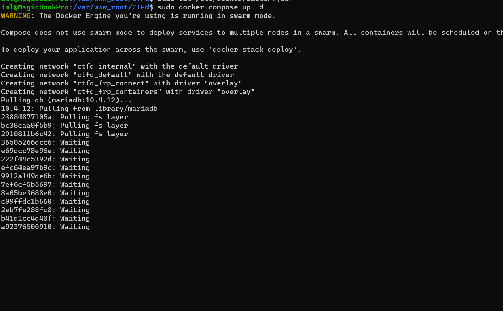

# CTFd v3.6.0 + ctfd-whale + ctfd-pages-theme


！！！！ 不要clone
请在 Releases 栏下载最新集成修改版本！！


## Update

>CTFd-2023-10-05_backup
- 后台添加docker动态环境,增加docker images 列表
- 修复前台一一些bug
- 添加了矩阵记分板


## 部分说明

* 集成环境

- CTFD version 3.6.0
- ctfd-whale  (docker 部署赛题)
- ctd-pages-theme (赛题分页显示)


- bilibili 视频使用教程

https://www.bilibili.com/video/BV1sK4y1w7uH


## Docker 安装


```python
sudo apt install docker
sudo apt install docker-compose
```


## 需要配置哪些？


* 端口范围


* docker加速

```python
/etc/docker/daemon.json 

{
  "registry-mirrors": [
    "https://docker.mirrors.ustc.edu.cn"
  ]
}
```


## 初始化集群


```python
sudo docker swarm init
sudo docker node update --label-add='name=linux-1' $(sudo docker node ls -q)
```

​


## CTFd ！启动


```pytthon
sudo docker-compose up -d
```

​


## 打包好的


```python
git clone https://github.com/imLZH1/ctfd_whale_pages.git
cd ctfd_whale_pages
docker-compose up -d

```


启动好后 用 admin:admin 登录后台 config->reset 清除数据，然后你就可以自己配置啦·？


* 交流群

```python

蔡徐坤篮球协会 信息部
QQ: 591613671
```

