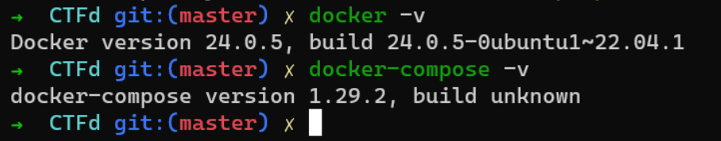
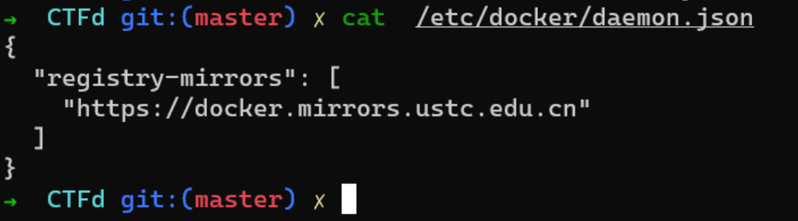
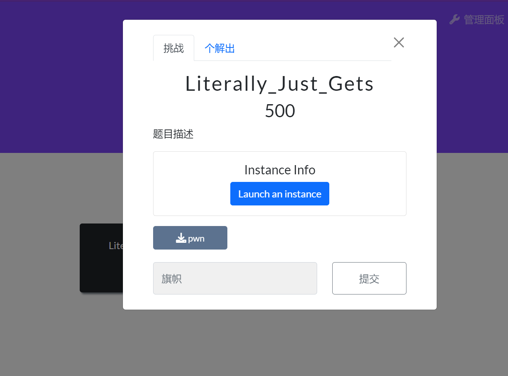

# CTFd集成修改版

‍

## 基础信息

‍

* 步骤 1 - 4 是制作的过程。
* 想无脑使用请从 `Releases`​  下载 zip(ctfd_whale_pages.zip) 解压到本地，然后看步骤5和6 既可。💩💩

‍

‍

‍

‍

关于我的配置情况

* ubuntu22.04
* CTFd 3.6.1  2024 年 2月最新版
* ctfd-pages-theme ( 题目分类分页)
* CTFd-Whale (用于动态docker环境) 年久失修，一些bug 我已经修复了
* 解题播报功能
* 矩阵记分板

‍

‍

‍

* 配置的过程用有一些 配置文件要填token，请自行修改

‍

‍

‍

## 1.下载 CTFd

```bash
git clone  https://github.com/CTFd/CTFd.git
```

​​

‍

## 2.更改 Dockerfile

* 主要是修改apt 和 pip 的更新源（改到国内，build 的时候就会快些）

```Dockerfile
FROM python:3.11-slim-bookworm as build

WORKDIR /opt/CTFd

# hadolint ignore=DL3008
# RUN echo `ls -alh /etc/apt/sources.list.d`
RUN sed -i "s@http://deb.debian.org@http://mirrors.aliyun.com@g" /etc/apt/sources.list.d/debian.sources
RUN apt-get update \
    && apt-get install -y --no-install-recommends \
        build-essential \
        libffi-dev \
        libssl-dev \
        git \
    && apt-get clean \
    && rm -rf /var/lib/apt/lists/* \
    && python -m venv /opt/venv

ENV PATH="/opt/venv/bin:$PATH"

COPY . /opt/CTFd

RUN pip install --no-cache-dir -r requirements.txt -i https://mirrors.ustc.edu.cn/pypi/web/simple \
    && for d in CTFd/plugins/*; do \
        if [ -f "$d/requirements.txt" ]; then \
            pip install --no-cache-dir -r "$d/requirements.txt"  -i https://mirrors.ustc.edu.cn/pypi/web/simple ;\
        fi; \
    done;


FROM python:3.11-slim-bookworm as release
WORKDIR /opt/CTFd

# hadolint ignore=DL3008
RUN sed -i "s@http://deb.debian.org@http://mirrors.aliyun.com@g" /etc/apt/sources.list.d/debian.sources
RUN apt-get update \
    && apt-get install -y --no-install-recommends \
        libffi8 \
        libssl3 \
    && apt-get clean \
    && rm -rf /var/lib/apt/lists/*

COPY --chown=1001:1001 . /opt/CTFd

RUN useradd \
    --no-log-init \
    --shell /bin/bash \
    -u 1001 \
    ctfd \
    && mkdir -p /var/log/CTFd /var/uploads \
    && chown -R 1001:1001 /var/log/CTFd /var/uploads /opt/CTFd \
    && chmod +x /opt/CTFd/docker-entrypoint.sh

COPY --chown=1001:1001 --from=build /opt/venv /opt/venv
ENV PATH="/opt/venv/bin:$PATH"

USER 1001
EXPOSE 8000
ENTRYPOINT ["/opt/CTFd/docker-entrypoint.sh"]
```

## 3.更改 docker-compose.yml

‍

```dockerfile
version: '3.3'

services:
  ctfd:
    build: .
    user: root
    restart: always
    ports:
      - "8000:8000"
    environment:
      - UPLOAD_FOLDER=/var/uploads
      - DATABASE_URL=mysql+pymysql://ctfd:ctfd@db/ctfd
      - REDIS_URL=redis://cache:6379
      - WORKERS=1
      - LOG_FOLDER=/var/log/CTFd
      - ACCESS_LOG=-
      - ERROR_LOG=-
      - REVERSE_PROXY=true
    volumes:
      - .data/CTFd/logs:/var/log/CTFd
      - .data/CTFd/uploads:/var/uploads
      - .:/opt/CTFd:ro
      - /var/run/docker.sock:/var/run/docker.sock
    depends_on:
      - db
    networks:
        default:
        internal:
        frp_connect:
          ipv4_address: 172.1.0.5

  db:
    image: mariadb:10.4.12
    restart: always
    environment:
      - MYSQL_ROOT_PASSWORD=ctfd
      - MYSQL_USER=ctfd
      - MYSQL_PASSWORD=ctfd
      - MYSQL_DATABASE=ctfd
    volumes:
      - .data/mysql:/var/lib/mysql
    networks:
        internal:
    # This command is required to set important mariadb defaults
    command: [mysqld, --character-set-server=utf8mb4, --collation-server=utf8mb4_unicode_ci, --wait_timeout=28800, --log-warnings=0]

  cache:
    image: redis:4
    restart: always
    volumes:
    - .data/redis:/data
    networks:
        internal:

  frps:
    image: glzjin/frp
    restart: unless-stopped
    volumes:
      - ./conf/frp:/conf
    entrypoint:
      - /usr/local/bin/frps
      - -c
      - /conf/frps.ini
    ports:
      - 50000-50100:50000-50100  # 映射direct类型题目的端口 # 根据需求去改映射端口的数量，  如果你的 ubuntu 性能太低，可以搞少一些
      - 9123:9123  # 映射http类型题目的端口 ,这里无所谓，无论是 pwn 还是 web 都可以使用 direst 的端口
    networks:
      default:
      frp_connect:
        ipv4_address: 172.1.0.3

  frpc:
    image: glzjin/frp:latest
    restart: unless-stopped
    volumes:
      - ./conf/frp:/conf/
    entrypoint:
      - /usr/local/bin/frpc
      - -c
      - /conf/frpc.ini
    depends_on:
      - frps
    networks:
      frp_containers:
      frp_connect:
        ipv4_address: 172.1.0.4

networks:
  default:
  internal:
    internal: true
  frp_connect:
    driver: overlay
    internal: true
    ipam:
      config:
        - subnet: 172.1.0.0/16
  frp_containers:
    driver: overlay
    internal: true  # 如果允许题目容器访问外网，则可以去掉
    attachable: true
    ipam:
      config:
        - subnet: 172.2.0.0/16
```

‍

## 3.配置 ctfd-pages-theme

* 来自 frankli0324

​​

```url
git clone https://github.com/frankli0324/ctfd-pages-theme
```

​​

‍

* 再配置一个接口用于分页功能

​​

‍

```vim
vim CTFd/api/v1/challenges.py
```

‍

```python
@challenges_namespace.route("/categories")
class ChallengeCategories(Resource):
    @challenges_namespace.doc(description="Endpoint to get Challenge categories in bulk")
    #@cache.memoize(timeout=60)
    def get(self):
        chal_q = (Challenges.query.with_entities(Challenges.category).group_by(Challenges.category))
        if not is_admin() or request.args.get("view") != "admin":
            chal_q = chal_q.filter(and_(Challenges.state != "hidden", Challenges.state != "locked"))
        return {"success": True, "data": [i.category for i in chal_q]}
```

​​

‍

‍

‍

## 4.配置 CTFd-Whale 插件

‍

* 此插件用于 动态docker 题目使用
* 由于年久失修 CTFd-Whale 在新版本的 CTFd 里使用会有一堆bug
* 我已经改了一份可以适配最新的CTFd 版本

‍

​​

‍

​​

‍

* 配置 conf 文件 . 没用就创建

​​

‍

* frpc.ini

```config
[common]
token = your_token
server_addr = 172.1.0.3
server_port = 7000
admin_addr = 172.1.0.4
admin_port = 7400
```

* frps.ini

```conf
[common]
bind_port = 7000
vhost_http_port = 9123
token = your_token
subdomain_host = node.vaala.ink
```

‍

* 然后再配置一个接口，用于后台展示 docker题目镜像（我自己加的一个功能）

‍

​​

 点击输入可以展示机器上的docker image , 然后点击可填入

​​

‍

‍

还是编辑 `CTFd/api/v1/challenges.py`​ 随便找个地方写入

```python
import docker

@challenges_namespace.route("/docker_images")
class GetDockerImages(Resource):
    @challenges_namespace.doc(description="No Docker Images")
    def get(self):
        if is_admin():
            client = docker.from_env()
            images = client.images.list()
            return {"success": True, "data": [image.tags[0] for image in images if image.tags] }
        return {"success": False}

```

​​

‍

‍

## 5.配置Ubuntu Docker 环境

* 先配置 环境 然后启动，后续再添加其他功能

### 5.1安装 docker

```shell
apt install docker
apt install docker-compose
```

​​

* 配置 docker 加速

```bash
{
  "registry-mirrors": [
    "https://docker.mirrors.ustc.edu.cn"
  ]
}
```

​​

‍

### 5.2初始化集群

‍

```python
sudo docker swarm init --force-new-cluster
sudo docker node update --label-add='name=linux-1' $(sudo docker node ls -q)
```

‍

​​

‍

### 5.3尝试启动

‍

‍

* 建议启动前执行这个

```bash
sudo chmod +x -R .
```

​​

* 真正的启动了！！

```bash
docker-compose up -d
```

* 如果没问题的话你会看到以下

​​

‍

‍

* 如果你看到类似下面的报错,(肯就是映射的端口太多导致的性能问题)

​​

* 重启尝试就好了

```pyhon
docker-compose stop # 关闭
docker-compose up -d # 然后再启动

后续就可以 用 stop 和 start 来控制 服务的开关
```

​​

‍

‍

### 5.4进入后台配置网络

‍

* 访问本机 :8080

​​

‍

* 如果看到爆红了，那可能就有问题了，可以尝试看看 上面的步骤有没有问题

​​

‍

* 如果没问题的话就像这样（没爆红之类的报错），然后就继续跟着做

​​

‍

* 查看docker 网络，找到 带 `frp_connect`​ 的

```bash
docker network ls
```

​​

* 连同前缀一起填进到 `Auto Connect Network`​，然后再页面下面点点击 `Submit`​ 保存

​​

​​​​

* 修改后即可刷新页面，看看有没有改成功

​​

‍

* 然后还有一个关键的端口映射，这个地方必须对应，不然你可能就访问不到了

​​

‍

‍

* 上面完成后，平台基本就可以了

‍

## 6.动态docker环境配置和测试

‍

### 6.1 docker环境模板

* 基础

​​

‍

* Dockerfile

```python
FROM ubuntu:22.04
# ubuntu 版本

RUN sed -i "s/http:\/\/archive.ubuntu.com/http:\/\/mirrors.ustc.edu.cn/g" /etc/apt/sources.list
RUN apt-get update && apt-get -y dist-upgrade
RUN apt-get update && apt-get install -y lib32z1 xinetd build-essential

RUN useradd -m ctf
WORKDIR /home/ctf
#RUN cp -R /lib* /home/ctf
RUN cp -R /usr/lib* /home/ctf

RUN mkdir /home/ctf/dev
RUN mknod /home/ctf/dev/null c 1 3
RUN mknod /home/ctf/dev/zero c 1 5
RUN mknod /home/ctf/dev/random c 1 8
RUN mknod /home/ctf/dev/urandom c 1 9
RUN chmod 666 /home/ctf/dev/*

#bin files
RUN mkdir /home/ctf/bin

RUN cp /bin/bash /home/ctf/bin
RUN cp /bin/sh /home/ctf/bin
RUN cp /usr/bin/timeout /home/ctf/bin
RUN cp /bin/ls /home/ctf/bin
RUN cp /bin/cat /home/ctf/bin

#remove not have
RUN rm -rf /home/ctf/lib/apt /home/ctf/lib/cpp /home/ctf/lib/gnupg /home/ctf/lib/init /home/ctf/lib/lsb /home/ctf/lib/os-release /home/ctf/lib/rsyslog /home/ctf/lib/tc /home/ctf/lib/udev /home/ctf/lib/binfmt.d /home/ctf/lib/dpkg /home/ctf/lib/gold-ld /home/ctf/lib/initramfs-tools /home/ctf/lib/ldscripts /home/ctf/lib/mime /home/ctf/lib/python2.7 /home/ctf/lib/systemd /home/ctf/lib/terminfo /home/ctf/lib/compat-ld /home/ctf/lib/gcc /home/ctf/lib/ifupdown /home/ctf/lib/insserv /home/ctf/lib/locale /home/ctf/lib/modules-load.d /home/ctf/lib/python3 /home/ctf/lib/tar /home/ctf/lib/tmpfiles.d


COPY ./ctf.xinetd /etc/xinetd.d/ctf
COPY ./run.sh /home/ctf

##################################### 关键的地方, 可以把相关的文件cppy进去，根据情况去修改
COPY ./files/pwn /home/ctf
#COPY ./files/libc.so /home/ctf
#COPY ./files/ld.so /home/ctf
####################################

RUN chmod +x /home/ctf/*
RUN chown -R root:ctf /home/ctf
RUN chmod -R 750 /home/ctf

RUN touch /home/ctf/*
RUN touch /home/ctf/*/*
#RUN touch /home/ctf/*/*/*

RUN echo "Blocked by ctf_xinetd" > /etc/banner_fail
RUN echo 'ctf - nproc 1500' >>/etc/security/limits.conf

# FALG 在环境变量里，
CMD exec /bin/bash -c 'echo $FLAG > /home/ctf/flag;FLAG=0;/etc/init.d/xinetd start; trap : TERM INT; sleep infinity & wait'
EXPOSE 9999
```

* docker-compose.yml

```python
version: "2"
services:
  pwn_game:
    build: .
    image: defcon31/livectf:Literally_Just_Gets # 当前pwn镜像name # 不要和其他环境name重复
    restart: unless-stopped

# image 的一些写法
#image: xxxctf/pwn:push_pop_Automaton
#image: xxxctfpwn:push_pop_Automaton
#image: push_pop_Automaton
```

* ctf.xinetd

```python
service ctf
{
    disable = no
    socket_type = stream
    protocol    = tcp
    wait        = no
    user        = root
    type        = UNLISTED
    port        = 9999
    bind        = 0.0.0.0
    server      = /usr/sbin/chroot
    # replace helloworld to your program
    server_args = --userspec=1000:1000 /home/ctf timeout 10 ./run.sh
    banner_fail = /etc/banner_fail
    # safety options
    per_source  = 10 # the maximum instances of this service per source IP address
    rlimit_cpu  = 60 # the maximum number of CPU seconds that the service may use
    rlimit_as  = 1024M # the Address Space resource limit for the service
    #access_times = 2:00-9:00 12:00-24:00

    #Instances=20 #process limit
    #per_source=5 #link ip limit

    #log warning die
    log_on_success = PID HOST EXIT DURATION
    log_on_failure  =HOST ATTEMPT
    log_type =FILE /var/log/myservice.log 8388608 15728640

}
```

‍

### build 制作一个镜像

‍

​​

在 动态pwn 赛题 目录 执行 ` docker-compose build`​ 即可

```python
 docker-compose build
```

​​

```python
docker images
```

​​

‍

### 在后台上传题目及附件

‍

​​

‍

​​

* 上面配置完后直接 `Create`​

​​

* 在 Challenges 可以看到我们创建的

​​

### 测试环境

​​

‍

​​

‍

‍

* 启动后就可以看到 IP 和端口了， 这里的`192.168.2.108`​ 可以在后台改

​​

* 改这就即可

​​

* docker环境正常启动，nc 测试正常

​​

‍

至此就结束了，下面的步骤可以不用管了

‍

## 7.其它的功能

### 矩阵记分板

‍

* 从官方仓库下载的

```python
https://github.com/CTFd/plugins
https://github.com/itszn/ctfd-matrix-scoreboard-plugin
```

‍

* 然后也是修改了一点

​​

‍

### 解题播报

‍

* 改`CTFd/api/v1/challenges.py`​
* 找到判断 flag 是正确的地方( 在文件里搜索 `The challenge plugin says the input is right`​ 即可找到)
* 在下面加上

```python
from CTFd.schemas.notifications import NotificationSchema # 放在文件头
from flask import current_app    # 放在文件

#######################################################################
# 解题播报 # 不需要这个功能可以注释$
challenge   = Challenges.query.filter_by(id=challenge_id).first_or_404()$
usern       = user.name$
challenge_name = challenge.name$
req = {$
     "title":"实时动态",$
     "content":f"恭喜 {usern} 成功解出 {challenge_name}!",$
     "type":"toast",$
     "sound":1$
     }$
schema = NotificationSchema()$
result = schema.load(req)$

db.session.add(result.data)$
db.session.commit()$

response = schema.dump(result.data)$

# Grab additional settings$
notif_type = req.get("type", "alert")$
notif_sound = req.get("sound", True)$                                                                                                                                          1                 response.data["type"] = notif_type$
response.data["sound"] = notif_sound$
current_app.events_manager.publish(data=response.data, type="notification")$
#######################################################################

```

​​

‍

​​

‍

## END 备注

* 如果遇到问题可以联系我：`QQ: 3461665835`​

* 我都水平不是太高，有些地方不会改
* 比如这些，可能会影响浏览器性能，

  * 用户列表没有分页
  * 后台赛题列表没有分页
  * 排行榜没用没有分页
* 有会改的大佬可以教教我
